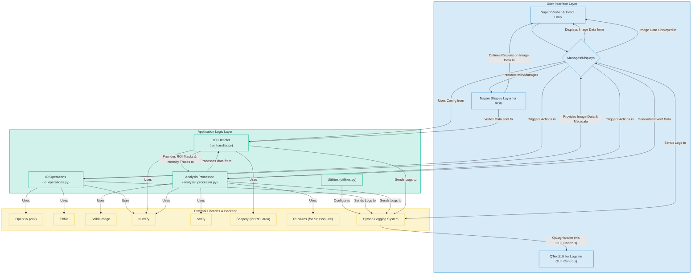

# BioImageSuiteLite - Architecture

This document provides a high-level overview of the software architecture for BioImageSuiteLite. It is intended for developers who wish to contribute to the project.

## Core Components

The application is divided into three logical layers:

1.  **User Interface Layer:** Built with `napari` and `PyQt5`. This layer is responsible for all visual elements, user interaction, and event handling.
2.  **Application Logic Layer:** Pure Python modules that handle the core scientific and data processing tasks.
3.  **External Libraries:** The underlying open-source libraries that provide the foundational tools for image processing, numerical analysis, and data handling.

## Architecture Diagram

The diagram below illustrates the relationships and data flow between the major components of the application.

### Explanation of Layers

*   **User Interface Layer:**
    *   **Napari Viewer & Event Loop:** The core engine from Napari that handles image display, windowing, and the main event processing.
    *   **BioImageSuiteLiteGUI Dock Widget:** The custom Qt widget (`gui_manager.py`) containing all buttons, input fields, and results tables, which is docked into the Napari viewer.
    *   **Napari Shapes Layer for ROIs:** A specialized Napari layer used for drawing and managing Regions of Interest directly on the image.

*   **Application Logic Layer:** These are the core, non-visual Python modules.
    *   **IO Operations (`io_operations.py`):** Handles loading media files and data export.
    *   **ROI Handler (`roi_handler.py`):** Manages ROI data (vertices, masks, area calculations) and extracts intensity traces.
    *   **Analysis Processor (`analysis_processor.py`):** Contains the scientific algorithms for event detection (threshold, DoG, Scisson-like), filtering, and normalization.

*   **External Libraries & Backend:**
    *   These are the third-party libraries your application relies on for specific tasks like image reading, numerical operations, and scientific calculations. 