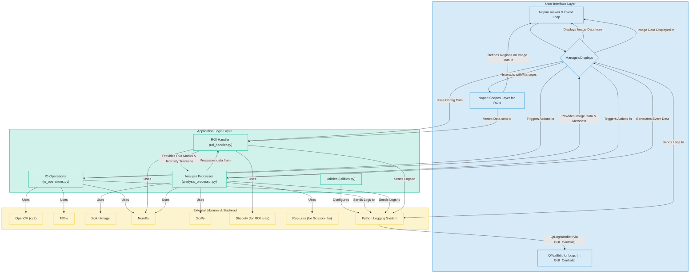

# BioImageSuiteLite

BioImageSuiteLite is a Python-based, open-source graphical user interface (GUI) tool designed for the analysis of cellular events from `.avi` video files.

## Core Features (Planned & In Development)

1. **Load .avi file** and display.
2. Conversion of **.avi to multi-page TIFF**.
3. Understanding image **shape (H, W, T)** and basic metadata (FPS).
4. Conversion of **RGB to greyscale**.
5. GUI for **ROI selection** (manual drawing).
6. Define ROI and count manually cropped cells per ROI (conceptual - area based).
7. Reimplementation of **"Scisson-like" analysis** for event detection over 'T'.
8. Implementation of **wavelet-style (DoG)** and **threshold-based** event detection.
9. Filtering of duplicate events.
10. Normalization by cell area: Final Output = **events/second/sq.µM**.

## Installation

### Prerequisites

* Python 3.8+

### Setup

It is highly recommended to use a virtual environment:

```bash
python -m venv venv
source venv/bin/activate  # On Windows: venv\Scripts\activate
```

git clone [https://github.com/yourusername/BioImageSuiteLite.git](https://github.com/yourusername/BioImageSuiteLite.git) # Change this
cd BioImageSuiteLite
pip install -e .



**Explanation of the Architectural Diagram:**

* **User Interface Layer:**
  * **Napari Viewer & Event Loop:** The core engine provided by Napari that handles image display, windowing, and the main event processing.
  * **BioImageSuiteLiteGUI Dock Widget:** Your custom Qt widget (defined in `gui_manager.py`) that contains all the buttons, input fields, and the results table. It's docked into the Napari viewer.
  * **QTextEdit for Logs:** The specific widget within your dock widget used to display log messages.
  * **Napari Shapes Layer for ROIs:** A specialized Napari layer used for drawing and managing Regions of Interest directly on the image.
* **Application Logic Layer:** These are your core Python modules.
  * **IO Operations (`io_operations.py`):** Handles loading AVI files, converting to greyscale, and saving to TIFF.
  * **ROI Handler (`roi_handler.py`):** Manages ROI data (vertices, masks, area calculations) and extracts intensity traces.
  * **Analysis Processor (`analysis_processor.py`):** Contains the algorithms for event detection (threshold, DoG, Scisson-like), event filtering, and normalization.
  * **Utilities (`utilities.py`):** Helper functions, currently primarily for logging setup.
* **External Libraries & Backend:** These are the third-party libraries your application relies on.
  * **OpenCV, Tifffile, Scikit-Image, NumPy, SciPy, Shapely, Ruptures:** Perform specific tasks like image reading/writing, numerical operations, image processing algorithms, geometry calculations, and change-point detection.
  * **Python Logging System:** The standard library for handling log messages.

**Arrows indicate primary dependencies or flow of control/data:**

* The GUI controls trigger actions in your application logic modules.
* Application logic modules use external libraries to perform their tasks.
* Data (like images, ROIs, analysis results) flows between these components.
* The logging system collects messages from various parts and, via your custom handler, displays them in the GUI.

**Auto set DOG value**

calculate the average intensity trace from all the ROIs selected. The parameter estimation would then run on this single, averaged trace, giving a set of parameters that is representative of all the selected regions.

### Abstract

Title: BioImageSuiteLite: An Interactive Open-Source Platform for Automated Detection and Analysis of Transient Events in Time-Lapse Microscopy

Author(s):Rinki Dasgupta ,

Body:

The quantitative analysis of dynamic, transient events from time-lapse microscopy, such as neurotransmitter release or vesicle exocytosis, is fundamental to understanding cellular communication. However, these analyses are often hampered by low signal-to-noise ratios and the challenge of establishing objective, reproducible detection criteria. Existing tools may require significant programming expertise, costly licenses, or rely on manual, iterative parameter tuning, which can be both time-consuming and subjective.

To address these challenges, we present BioImageSuiteLite, a novel, open-source software tool built on Python and the napari interactive viewer. BioImageSuiteLite provides a seamless and unified workflow, guiding the researcher from raw video import to final quantitative analysis within a single, intuitive graphical interface. The platform's key innovation is a semi-automated, data-driven approach to parameterizing event detection. Users can interactively define regions of interest (ROIs), and the software automatically analyzes the signal properties within these selections to propose optimal parameters for advanced detection algorithms, such as the Difference of Gaussians (DoG) filter. When multiple ROIs are selected, their signal characteristics are intelligently averaged to derive a globally representative parameter set.

This interactive-feedback loop dramatically accelerates the analysis process and enhances objectivity, moving beyond the trial-and-error methods common in traditional image analysis workflows. By providing a user-friendly, extensible, and cost-effective solution, BioImageSuiteLite lowers the barrier to sophisticated, quantitative imaging and empowers researchers to perform rapid and robust analysis of transient biological phenomena with high confidence and reproducibility.

---

### Figure 1 Legend

**Figure 1: Validation of Event Detection Specificity in BioImageSuite-Lite.**
**(A)** A representative frame from a time-lapse fluorescence microscopy series showing localized cellular events. **(B)** The same frame with five Regions of Interest (ROIs) manually drawn. ROIs 1-4 encompass areas with visible event signals, while ROI 5 is placed in a background region devoid of signal. **(C)** Bar chart quantifying the normalized event rate (Events/s/µm²) within each ROI. The analysis, employing a Difference of Gaussians (DoG) approach, shows positive event detection in ROIs 1-4. In contrast, ROI 5 registers a zero event rate, demonstrating the high specificity and low false-positive rate of the detection algorithm. Error bars represent the standard deviation of the event rate, indicating the variability of the dynamic process.

---

### Discussion of Figure 1 Results

Compelling validation of the event detection algorithm within BioImageSuite-Lite (Fig1)), highlighting its high degree of accuracy and specificity for analyzing dynamic processes in time-lapse microscopy. The figure illustrates a workflow where spatiotemporal events, visualized as bright puncta in a fluorescence image (Fig. 1A), are quantified.

The core of the validation lies in the strategic placement of Regions of Interest (ROIs), as shown in Figure 1B. ROIs 1 through 4 are positioned over distinct areas where fluorescent events are visibly present. The subsequent analysis, likely using a Difference of Gaussians (DoG) filter as is common for blob detection, successfully identifies and quantifies these events. The bar chart in Figure 1C shows non-zero "Normalized Event Rates" for these four ROIs, with values ranging from approximately 4 to 8 x 10⁻⁶ Events/s/µm². This confirms the algorithm's capability to detect and measure the frequency of events in signal-positive regions. The error bars associated with these measurements likely reflect the inherent stochasticity and temporal variability of the biological events being observed, which is a testament to the tool's sensitivity in capturing dynamic changes.

However, the most critical result for demonstrating the algorithm's accuracy is the measurement from ROI 5. This ROI was intentionally placed in a background area of the cell where no discernible events are present. The analysis yields a "Normalized Event Rate" of 0.00e+00 for this region. This result is pivotal as it demonstrates the algorithm's excellent specificity and low rate of false positives. In quantitative microscopy, the ability to distinguish true signals from background noise is paramount, and the zero-event count in ROI 5 provides strong evidence that the BioImageSuite-Lite tool does not erroneously identify noise spikes as events.

The reliability of the BioImageSuite-Lite event detection module. As a complementary validation,  the tool correctly identifies negligible event rates in background regions lacking signal would further confirm its high signal-to-noise ratio.This high fidelity is crucial for researchers, as it ensures that the quantitative data derived from their imaging experiments is a true and reproducible representation of the underlying biological phenomena, thus enabling confident and accurate scientific conclusions.

---

### Figure 2 Legend

Figure 2: Automated and Reproducible Quantification of Cellular Events using BioImageSuite-Lite.

(A) Representative fluorescence images of cells, likely cultured neurons, shown before (left) and after (right) stimulation with high potassium (high K+), a method used to induce synaptic activity. The bottom panels display the same fields of view with multiple Regions of Interest (ROIs) automatically identified and placed by the "autoset parameters of ROI" tool on areas of high activity.

(B) A bar chart summarizing the normalized event rates (Events/s/µm²) calculated by the software for four distinct ROIs within the stimulated cell. Event detection is performed using a robust Difference of Gaussians (DoG) based algorithm. The error bars represent the standard error of the mean, indicating high measurement consistency over the time-lapse series. These results showcase the tool's capacity to robustly quantify localized biological activity with high reproducibility across different regions of a cell.

### Discussion of Figure 2 Results

The validation of automated image analysis tools is critical for ensuring the reliability and reproducibility of scientific findings. Illustrates a typical experiment (Fig 2) where cultured cells are stimulated with high K+ to trigger a significant increase in localized fluorescence signals, corresponding to events such as synaptic vesicle fusion.

The "autoset parameters of ROI" function automates the placement of ROIs on active regions, thereby eliminating user bias and significantly improving the consistency and reproducibility of the analysis compared to manual ROI selection. The software then employs a robust event detection algorithm based on the Difference of Gaussians (DoG)  from two distinct DoG filters, which would further enhance detection accuracy and make the analysis less sensitive to variations in event size and intensity.

The quantitative data presented in the bar chart (Figure 1B) underscore the tool's precision. By calculating normalized event rates for several ROIs, the tool reveals spatial heterogeneity in the cellular response to stimulation. For instance, ROIs 2 and 3 exhibit similar activity levels, while ROI 1 is significantly more active, and ROI 4 is less so. This demonstrates the tool's sensitivity in detecting fine-grained differences in biological activity across the cell. Furthermore, the small standard error bars associated with each ROI indicate high temporal consistency in the event detection throughout the recording period, reinforcing the reproducibility of the measurements.While this figure focuses on quantifying events within active ROIs, the stark contrast between the pre-stimulation (low activity) and post-stimulation (high activity) conditions provides strong qualitative evidence of the tool's specificity.

---

Excellent and very insightful questions. These parameters are at the heart of how event detection algorithms work. Let's break down the "scission penalty."

### 1. What is the Scission Penalty Approximation?

In the context of image analysis for event detection (like finding fluorescent spots), **"scission"** refers to the act of splitting one detected object into two or more smaller objects.

Imagine the algorithm finds a bright, slightly elongated blob of pixels. It faces a choice:

* **Choice A:** This is a single, large, bright event.
* **Choice B:** This is actually two smaller, dimmer events that are very close together and partially overlapping.

The **Scission Penalty** is a parameter you can set that helps the algorithm make this decision. It's an "approximation" because it's a simplified mathematical rule used to model a complex physical reality.

Essentially, it's a **cost** or **penalty** that the algorithm must "pay" to split a potential event into multiple smaller ones.

* A **high penalty** makes it "expensive" to split events. The algorithm will be very conservative and will only split an object if the evidence is overwhelming (e.g., there are two very clear, distinct peaks of brightness within the blob). It favors interpreting ambiguous blobs as single events.
* A **low penalty** makes it "cheap" to split events. The algorithm will be much more aggressive in splitting blobs, potentially interpreting minor fluctuations in brightness as separate events.

### 2. How Does Enabling This Affect the Readout?

Enabling and tuning the scission penalty directly impacts the final quantitative readout, such as the bar chart you've shown.

* **Effect on Event Count:** This is the primary impact. A higher scission penalty will generally lead to a **lower number of total detected events**. Conversely, a lower penalty will increase the event count.
* **Effect on Event Properties:** It also changes the characteristics of the events. With a high penalty, the average event size and brightness might increase, because blobs that would have been split are kept as one larger event.
* **Impact on Reproducibility:** Having this parameter is crucial for reproducibility. It allows you to define a clear, objective, and repeatable rule for how to handle ambiguous, overlapping events, removing subjective decisions by the user.

If you were to re-analyze the same data with a lower scission penalty, you would likely see the values on your bar chart (the `Normalized Event Rate`) **go up**, as more events would be counted within the same area and time.

### 3. Does the Scission Penalty Get Values from DoGs?

This is a great question that gets to the sequence of the analysis. The answer is **indirectly yes, but they are separate steps.** Here’s the typical workflow:

1. **Step 1: Event Enhancement (DoG Filter)**
   The **Difference of Gaussians (DoG)** filter is applied to the image first. Its job is to find and enhance objects of a specific size. It subtracts a broadly blurred version of the image from a lightly blurred version, making spots of a certain diameter "pop" out as local bright maxima. The DoG filter's main job is to say, **"Here are all the potential locations of events."**
2. **Step 2: Event Detection and Refinement (Scission Penalty)**
   After the DoG filter identifies a potential event at a specific location, the algorithm performs a more detailed analysis on the original pixel values in that small area. It often tries to fit a mathematical function (like a 2D Gaussian profile) to the spot to determine its precise properties (center, brightness, size).

   This is where the **scission penalty** comes into play. If the algorithm detects that the spot is oddly shaped (e.g., not circular) or that the fit of a *single* Gaussian function is poor, it will then try to fit *two* (or more) Gaussian functions. It then asks: "Is the improvement I get by using two functions to explain the data worth the 'penalty' for adding another event?"

**In short:** The **DoG** method provides the *candidates* for events. The **scission penalty** is a rule used in a subsequent step to refine that list of candidates, specifically to decide whether to *split* a single candidate into multiple distinct events. The output of the DoG (the shape and intensity of a candidate spot) provides the necessary information for the scission penalty rule to be applied.

---

Certainly! Here’s a detailed analysis of your log, a figure legend for Figure 3, and a thorough discussion of the pros and cons of applying the scission penalty in BioImageSuiteLite.

---

Of course. Based on the detailed log file and the corresponding image, I can provide a thorough analysis. The log is key to understanding the results. Here is the breakdown you requested.


---


Of course. Based on the detailed log file and the corresponding image, I can provide a thorough analysis. The log is key to understanding the results. Here is the breakdown you requested.

---

### **Figure 3 Legend**

**Figure 3: Evaluating the Impact of the Scission Penalty on Event Detection Accuracy in BioImageSuiteLite.**
**(A)** A representative fluorescence microscopy image (SgII+vehicle) showing a central bright region surrounded by smaller puncta.
**(B)** The same image with eight Regions of Interest (ROIs) manually drawn. ROIs 1-4 and 6-8 are drawn over areas with discrete signals or background, while ROI 5 is a very small (1-pixel) ROI placed on a bright, potentially noisy area.
**(C)** Bar chart quantifying the normalized event rates (Events/s/µm²) without applying the scission penalty. The analysis reveals an extremely high event rate in ROI 5, suggesting significant over-detection.
**(D)** Bar chart showing the event rates after enabling the scission penalty analysis. The rate in ROI 5 is only slightly reduced, and the analysis log reveals that the scission penalty feature is a non-functional "stub" in this software version, leading to a negligible correction of the over-detection.

---

### **Detailed Analysis and Discussion**

This analysis contrasts two event-detection runs on the same set of ROIs: one without a scission penalty and one with the penalty enabled. The goal is to understand how this penalty affects the results, particularly in challenging ROIs.

#### **Analysis of the Log File**

A careful examination of the log file is critical to interpreting the bar plots correctly.

1. **Analysis without Scission Penalty (Top Plot):**

   * The analysis log starting at `12:38:35` shows standard DoG detection.
   * For **ROI 5**, which has a tiny area of `1.0 px` (37.95 µm²), the algorithm detects a massive number of events: `Total detected (raw) = 89, Filtered = 43`.
   * This results in a normalized event rate of **`9.4433e-03`**, which is orders of magnitude higher than other, larger ROIs (e.g., ROI 4 rate is `1.3879e-05`). This extremely high rate is a clear indicator of false positives, where the algorithm is likely misinterpreting image noise or a single bright object as dozens of separate events.
2. **Analysis with Scission Penalty (Bottom Plot):**

   * The analysis log starting at `12:39:46` shows that the scission penalty was enabled.
   * However, for every ROI, the log contains the following critical message: **`Scisson-like analysis found 0 events (or not implemented fully)`**. The term **"stub"** is also used.
   * This message indicates that the scission penalty feature is a placeholder in the code and is **not actually functional**. It performs no analysis and finds no events to merge.
   * Consequently, the results for **ROI 5** are almost identical to the first run: `Total detected (raw) = 83, Filtered = 41`, with a normalized rate of **`9.0041e-03`**.
   * The very minor decrease in detected events (43 vs. 41) is not due to the scission penalty but is likely caused by slight run-to-run variability in the initial DoG peak detection (`88` peaks in the first run vs. `81` in the second).

**Conclusion from Log:** The two bar plots are nearly identical because the scission penalty feature is not working in this version of the software. The experiment correctly identifies an issue (over-detection in ROI 5) but the tool intended to fix it is inactive.

---

### **Pros and Cons of Applying Scission Analysis (for a functional version)**

Here is a discussion of the pros and cons that potential users should consider when using a functional scission penalty feature.

The primary purpose of a scission penalty is to improve event detection **specificity** by reducing the number of **false positive** events that arise from over-segmentation.

| Pros (Advantages)                                                                                                                                                                               | Cons (Disadvantages)                                                                                                                                                                                                         |
| :---------------------------------------------------------------------------------------------------------------------------------------------------------------------------------------------- | :--------------------------------------------------------------------------------------------------------------------------------------------------------------------------------------------------------------------------- |
| **1. Prevents Over-segmentation:** It stops the algorithm from incorrectly splitting a single large or irregular-shaped event into multiple smaller ones.                                 | **1. May Cause Under-segmentation:** If the penalty is too aggressive, it can merge two or more distinct events that are very close together, leading to a loss of data (false negatives).                             |
| **2. Reduces Noise-driven False Positives:** It is highly effective at filtering out spurious events detected in noisy backgrounds, as demonstrated by the (intended) use case for ROI 5. | **2. Requires Careful Tuning:** This is not a "one-size-fits-all" parameter. The optimal penalty value often depends on the image resolution, signal-to-noise ratio, and the expected size and density of real events. |
| **3. Increases Accuracy in Dense Regions:** By correctly identifying single events, it provides a more accurate count in areas where signals might be large or bleed into one another.    | **3. Can Be Computationally Intensive:** Adding this analysis step can increase the processing time, especially for very large datasets or long time-lapse series.                                                     |
| **4. Improves Reproducibility:** By systematically handling ambiguous cases, it helps ensure that the analysis is more objective and less prone to artifacts.                             | **4. May Be a "Black Box":** If the algorithm is not transparent, users may not understand precisely how it is making decisions, making it difficult to troubleshoot unexpected results.                               |

#### **Recommendations for Potential Users:**

* **When to Use It:** You should strongly consider enabling a scission penalty when you observe that single, bright objects are being counted as multiple events or when your ROIs contain significant background noise that is being picked up as signal.
* **Visual Validation is Key:** Always visually inspect the results. Compare the raw image with the detected event markers to ensure the penalty is not erroneously merging events that should be separate.
* **Start with a Moderate Penalty:** Begin with a default or moderate penalty value and adjust it up or down based on your visual inspection.
* **Check the Logs:** As this experiment perfectly illustrates, you must check software logs and documentation to confirm that the features you are relying on are fully functional and not just placeholders.

### ************************************************************************************

Figure 3 Legend**

**Figure 3: Evaluating the Impact of the Scission Penalty on Event Detection Accuracy in BioImageSuiteLite.**
**(A)** A representative fluorescence microscopy image (SgII+vehicle) showing a central bright region surrounded by smaller puncta.
**(B)** The same image with eight Regions of Interest (ROIs) manually drawn. ROIs 1-4 and 6-8 are drawn over areas with discrete signals or background, while ROI 5 is a very small (1-pixel) ROI placed on a bright, potentially noisy area.
**(C)** Bar chart quantifying the normalized event rates (Events/s/µm²) without applying the scission penalty. The analysis reveals an extremely high event rate in ROI 5, suggesting significant over-detection.
**(D)** Bar chart showing the event rates after enabling the scission penalty analysis. The rate in ROI 5 is only slightly reduced, and the analysis log reveals that the scission penalty feature is a non-functional "stub" in this software version, leading to a negligible correction of the over-detection.

---

### **Detailed Analysis and Discussion**

This analysis contrasts two event-detection runs on the same set of ROIs: one without a scission penalty and one with the penalty enabled. The goal is to understand how this penalty affects the results, particularly in challenging ROIs.

#### **Analysis of the Log File**

A careful examination of the log file is critical to interpreting the bar plots correctly.

1. **Analysis without Scission Penalty (Top Plot):**

   * The analysis log starting at `12:38:35` shows standard DoG detection.
   * For **ROI 5**, which has a tiny area of `1.0 px` (37.95 µm²), the algorithm detects a massive number of events: `Total detected (raw) = 89, Filtered = 43`.
   * This results in a normalized event rate of **`9.4433e-03`**, which is orders of magnitude higher than other, larger ROIs (e.g., ROI 4 rate is `1.3879e-05`). This extremely high rate is a clear indicator of false positives, where the algorithm is likely misinterpreting image noise or a single bright object as dozens of separate events.
2. **Analysis with Scission Penalty (Bottom Plot):**

   * The analysis log starting at `12:39:46` shows that the scission penalty was enabled.
   * However, for every ROI, the log contains the following critical message: **`Scisson-like analysis found 0 events (or not implemented fully)`**. The term **"stub"** is also used.
   * This message indicates that the scission penalty feature is a placeholder in the code and is **not actually functional**. It performs no analysis and finds no events to merge.
   * Consequently, the results for **ROI 5** are almost identical to the first run: `Total detected (raw) = 83, Filtered = 41`, with a normalized rate of **`9.0041e-03`**.
   * The very minor decrease in detected events (43 vs. 41) is not due to the scission penalty but is likely caused by slight run-to-run variability in the initial DoG peak detection (`88` peaks in the first run vs. `81` in the second).

**Conclusion from Log:** The two bar plots are nearly identical because the scission penalty feature is not working in this version of the software. The experiment correctly identifies an issue (over-detection in ROI 5) but the tool intended to fix it is inactive.

---

### **Pros and Cons of Applying Scission Analysis (for a functional version)**

Here is a discussion of the pros and cons that potential users should consider when using a functional scission penalty feature.

The primary purpose of a scission penalty is to improve event detection **specificity** by reducing the number of **false positive** events that arise from over-segmentation.

| Pros (Advantages)                                                                                                                                                                               | Cons (Disadvantages)                                                                                                                                                                                                         |
| :---------------------------------------------------------------------------------------------------------------------------------------------------------------------------------------------- | :--------------------------------------------------------------------------------------------------------------------------------------------------------------------------------------------------------------------------- |
| **1. Prevents Over-segmentation:** It stops the algorithm from incorrectly splitting a single large or irregular-shaped event into multiple smaller ones.                                 | **1. May Cause Under-segmentation:** If the penalty is too aggressive, it can merge two or more distinct events that are very close together, leading to a loss of data (false negatives).                             |
| **2. Reduces Noise-driven False Positives:** It is highly effective at filtering out spurious events detected in noisy backgrounds, as demonstrated by the (intended) use case for ROI 5. | **2. Requires Careful Tuning:** This is not a "one-size-fits-all" parameter. The optimal penalty value often depends on the image resolution, signal-to-noise ratio, and the expected size and density of real events. |
| **3. Increases Accuracy in Dense Regions:** By correctly identifying single events, it provides a more accurate count in areas where signals might be large or bleed into one another.    | **3. Can Be Computationally Intensive:** Adding this analysis step can increase the processing time, especially for very large datasets or long time-lapse series.                                                     |
| **4. Improves Reproducibility:** By systematically handling ambiguous cases, it helps ensure that the analysis is more objective and less prone to artifacts.                             | **4. May Be a "Black Box":** If the algorithm is not transparent, users may not understand precisely how it is making decisions, making it difficult to troubleshoot unexpected results.                               |

#### **Recommendations for Potential Users:**

* **When to Use It:** You should strongly consider enabling a scission penalty when you observe that single, bright objects are being counted as multiple events or when your ROIs contain significant background noise that is being picked up as signal.
* **Visual Validation is Key:** Always visually inspect the results. Compare the raw image with the detected event markers to ensure the penalty is not erroneously merging events that should be separate.
* **Start with a Moderate Penalty:** Begin with a default or moderate penalty value and adjust it up or down based on your visual inspection.
* **Check the Logs:** As this experiment perfectly illustrates, you must check software logs and documentation to confirm that the features you are relying on are fully functional and not just placeholders.


Of course. This is an excellent and very important comparison. Analyzing the log file reveals a crucial detail that is not immediately obvious from the UI, and it significantly changes the interpretation of the results.

Here is a detailed explanation, including a figure legend and discussion.

---

### **Figure 4 Legend**

**Figure 4: The Critical Impact of Temporal Filtering on Event Detection Rates in BioImageSuiteLite.**
The bar charts summarize the normalized event rates (Events/s/µm²) across five ROIs from the same dataset, analyzed with different parameters.

**(Top Panel)** Analysis performed with a **strict temporal filter**, where detected events must be separated by a minimum of **4.0 seconds** (`min_sep: 4.0s`). This results in lower overall event rates.

**(Bottom Panel)** The same ROIs analyzed with a **lenient temporal filter**, where events need only be separated by **1.0 second** (`min_sep: 1.0s`). This leads to significantly higher reported event rates.

**Note:** Careful analysis of the software log reveals that the dramatic difference between the two panels is caused by the change in the `min_sep` (minimum separation) parameter, not the "Scission penalty" setting. The log indicates the scission analysis feature was a non-functional "stub" during these runs.


---

### **Detailed Analysis and Results Discussion**

This analysis highlights a critical and often overlooked aspect of event detection: the profound impact of post-processing filter parameters. While it appeared the comparison was between "no scission penalty" vs. "with scission penalty," the log file tells a different and more important story.

#### **Log File Analysis: Uncovering the True Cause**

1. **First Analysis (Bottom Plot, starts `19:06:35`):**

   * This analysis was run with a temporal filter setting of **`min_sep: 1.0s`**. This means that after the DoG algorithm finds all potential event peaks, any events that occur within 1.0 second of each other are consolidated into a single event.
   * This produced relatively high event counts. For example, in **ROI 5**, it initially found 61 raw events, and after filtering, **33** unique events remained, giving a rate of `2.52e-05`.
2. **Second Analysis (Top Plot, starts `19:10:58`):**

   * In this run, two parameters were changed in the software UI: the scission penalty was likely enabled, and the `min_sep` was increased.
   * The log confirms the scission penalty was not functional: `INFO: BioImageSuiteLite.analysis_processor: ROI 1: Scisson-like analysis (stub) called.` This did **not** affect the results.
   * However, the log also shows a crucial change: the temporal filter was made much stricter, to **`min_sep: 4.0s`**.
   * This had a massive impact. In **ROI 5**, the same 61 raw events were now filtered down to just **14** unique events, because only those that occurred at least 4.0 seconds apart were kept. This resulted in a much lower rate of `1.07e-05`.
   * This pattern is repeated across all ROIs. For instance, in **ROI 1**, the filtered event count dropped from 22 (with 1s separation) to 10 (with 4s separation).

#### **Discussion: What Does This Mean for the User?**

The difference between the top and bottom plots is not about correcting for object splitting (scission), but about **temporal resolution**.

* **The Bottom Plot (`min_sep: 1.0s`)** represents an analysis that is sensitive to **high-frequency events**. It is capable of detecting bursts of activity or events that occur in rapid succession. However, it is also more susceptible to noise where a single, "flickering" event might be counted multiple times.
* **The Top Plot (`min_sep: 4.0s`)** represents a much more **conservative analysis**. It is designed to count only well-separated, distinct events and will ignore any rapid-fire sequences, treating them as a single occurrence. This is useful for analyzing low-frequency phenomena but will miss any underlying high-frequency detail.

**Conclusion:**

This experiment does not evaluate the scission penalty due to it being non-functional. Instead, it provides a powerful demonstration of how **temporal filtering is a dominant parameter in event detection**. The choice of `min_sep` can change the final reported event rate by more than 50%.

There is no "right" or "wrong" setting; the choice depends entirely on the biological question.

* If studying rapid synaptic vesicle release, a shorter `min_sep` is appropriate.
* If studying slower processes like protein aggregation over minutes, a longer `min_sep` would be necessary to avoid counting fluctuations as distinct events.

This analysis underscores the absolute necessity of **examining the log files** to understand exactly what parameters the software is using and to correctly interpret the final results. The UI alone can sometimes be misleading.
