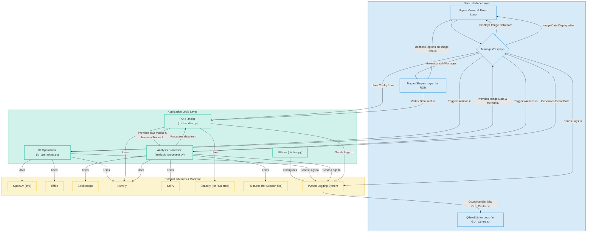

# BioImageSuiteLite

BioImageSuiteLite is a Python-based, open-source graphical user interface (GUI) tool designed for the analysis of cellular events from `.avi` video files.

## Core Features (Planned & In Development)

1. **Load .avi file** and display.
2. Conversion of **.avi to multi-page TIFF**.
3. Understanding image **shape (H, W, T)** and basic metadata (FPS).
4. Conversion of **RGB to greyscale**.
5. GUI for **ROI selection** (manual drawing).
6. Define ROI and count manually cropped cells per ROI (conceptual - area based).
7. Reimplementation of **"Scisson-like" analysis** for event detection over 'T'.
8. Implementation of **wavelet-style (DoG)** and **threshold-based** event detection.
9. Filtering of duplicate events.
10. Normalization by cell area: Final Output = **events/second/sq.µM**.

## Installation

### Prerequisites

* Python 3.8+

### Setup

It is highly recommended to use a virtual environment:

```bash
python -m venv venv
source venv/bin/activate  # On Windows: venv\Scripts\activate
```

git clone [https://github.com/yourusername/BioImageSuiteLite.git](https://github.com/yourusername/BioImageSuiteLite.git) # Change this
cd BioImageSuiteLite
pip install -e .



**Explanation of the Architectural Diagram:**

* **User Interface Layer:**
  * **Napari Viewer & Event Loop:** The core engine provided by Napari that handles image display, windowing, and the main event processing.
  * **BioImageSuiteLiteGUI Dock Widget:** Your custom Qt widget (defined in `gui_manager.py`) that contains all the buttons, input fields, and the results table. It's docked into the Napari viewer.
  * **QTextEdit for Logs:** The specific widget within your dock widget used to display log messages.
  * **Napari Shapes Layer for ROIs:** A specialized Napari layer used for drawing and managing Regions of Interest directly on the image.
* **Application Logic Layer:** These are your core Python modules.
  * **IO Operations (`io_operations.py`):** Handles loading AVI files, converting to greyscale, and saving to TIFF.
  * **ROI Handler (`roi_handler.py`):** Manages ROI data (vertices, masks, area calculations) and extracts intensity traces.
  * **Analysis Processor (`analysis_processor.py`):** Contains the algorithms for event detection (threshold, DoG, Scisson-like), event filtering, and normalization.
  * **Utilities (`utilities.py`):** Helper functions, currently primarily for logging setup.
* **External Libraries & Backend:** These are the third-party libraries your application relies on.
  * **OpenCV, Tifffile, Scikit-Image, NumPy, SciPy, Shapely, Ruptures:** Perform specific tasks like image reading/writing, numerical operations, image processing algorithms, geometry calculations, and change-point detection.
  * **Python Logging System:** The standard library for handling log messages.

**Arrows indicate primary dependencies or flow of control/data:**

* The GUI controls trigger actions in your application logic modules.
* Application logic modules use external libraries to perform their tasks.
* Data (like images, ROIs, analysis results) flows between these components.
* The logging system collects messages from various parts and, via your custom handler, displays them in the GUI.
