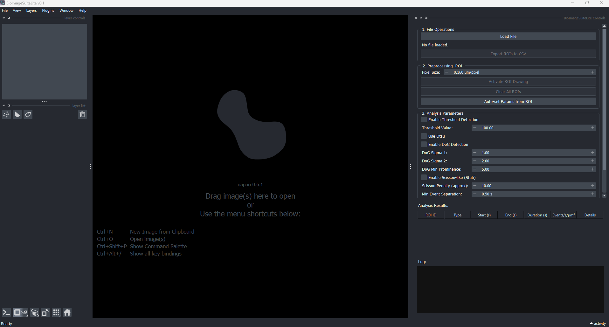
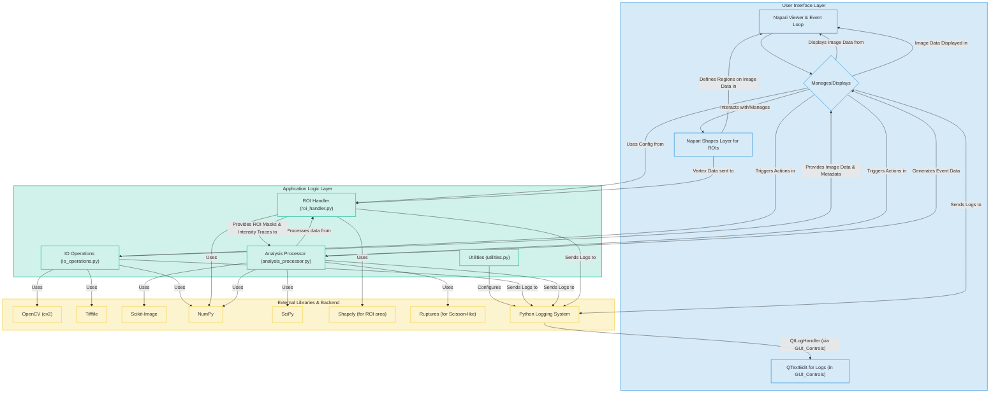

# ioImageSuiteLite

[](https://opensource.org/licenses/MIT)
[](https://badge.fury.io/py/bioimagesuitelite)

**An Interactive Open-Source Platform for Automated Detection and Analysis of Transient Events in Time-Lapse Microscopy**



***A screenshot of the main BioImageSuiteLite interface.***

---

## Overview

BioImageSuiteLite is a user-friendly desktop application designed for biologists and researchers to analyze time-lapse microscopy data. It provides an all-in-one workflow for:

* **Loading Data:** Import `.avi` files or multi-page `.tif`/`.tiff` files.
* **Defining Regions of Interest (ROIs):** Draw ROIs directly on the image to focus analysis on specific areas.
* **Image Processing:** Apply common bioimage analysis filters like Difference of Gaussians (DoG) for feature enhancement.
* **Segmentation:** Use automated thresholding methods like Otsu's to identify cells or other objects.
* **Analysis & Visualization:** Calculate and plot event frequency, intensity changes, and other metrics over time.
* **Exporting Results:** Save analysis data to `.csv` files.

This tool was built using Python, with a graphical user interface powered by Napari.

## Installation

There are two ways to install BioImageSuiteLite:

### 1. Simple Installation (Recommended)

Once published, you will be able to install the package directly using pip:

```bash
pip install bioimagesuitelite
```

### 2. From Source

For the latest development version:

```bash
git clone https://github.com/raju1stnov/BioImageSuiteLite.git
cd BioImageSuiteLite
pip install -e .
```

## Quick Start

1. **Launch the application:**
   Open your terminal or command prompt and run:
   ```bash
   bioimagesuitelite
   ```
2. **Load your data:**
   Use the "Load File" button to open your microscopy data (.avi or .tif/.tiff files).
3. **Draw an ROI:**
   Select the "Polygon" tool in the Napari viewer and draw a region around the cells you want to analyze.
4. **Run Analysis:**
   Adjust the parameters in the GUI and click the "Run Analysis" button.
5. **Explore Results:**
   View the generated plots and save your data using the "Save Data" button.

For a detailed walkthrough, see our [Example Notebook](./examples/usage_demo.ipynb) or the full [User Guide](./UserGuide.md).

## For Developers

### Setting up the Environment

```bash
# Clone the repository
git clone https://github.com/raju1stnov/BioImageSuiteLite.git
cd BioImageSuiteLite

# Create a virtual environment
python -m venv bio_venv
source bio_venv/bin/activate  # On Windows use `bio_venv\Scripts\activate`

# Install dependencies
pip install -r requirements.txt
```

### Running the GUI from source

To launch the GUI directly from the source code, run:

```bash
python -m BioImageSuiteLite.gui_manager
```

## How to Cite

If you use BioImageSuiteLite in your research, please cite it. Once you obtain a DOI from Zenodo, you can add it here, for example:

> Rinki Dasgupta. (2024). BioImageSuiteLite (v0.1.0). Zenodo. https://doi.org/10.5281/zenodo.YOUR_DOI_HERE

## License

This project is licensed under the MIT License. See the [LICENSE](./LICENSE) file for details.

## Core Features (Planned & In Development)

1. **Load video files** (.avi or multi-page .tif/.tiff) and display.
2. Understanding image **shape (H, W, T)** and basic metadata (FPS).
3. Conversion of **RGB to greyscale**.
4. GUI for **ROI selection** (manual drawing).
5. Define ROI and count manually cropped cells per ROI (conceptual - area based).
6. Reimplementation of **"Scisson-like" analysis** for event detection over 'T'.
7. Implementation of **wavelet-style (DoG)** and **threshold-based** event detection.
8. Filtering of duplicate events.
9. Normalization by cell area: Final Output = **events/second/sq.µM**.



**Explanation of the Architectural Diagram:**

* **User Interface Layer:**
  * **Napari Viewer & Event Loop:** The core engine provided by Napari that handles image display, windowing, and the main event processing.
  * **BioImageSuiteLiteGUI Dock Widget:** Your custom Qt widget (defined in `gui_manager.py`) that contains all the buttons, input fields, and the results table. It's docked into the Napari viewer.
  * **QTextEdit for Logs:** The specific widget within your dock widget used to display log messages.
  * **Napari Shapes Layer for ROIs:** A specialized Napari layer used for drawing and managing Regions of Interest directly on the image.
* **Application Logic Layer:** These are your core Python modules.
  * **IO Operations (`io_operations.py`):** Handles loading AVI files, converting to greyscale, and saving to TIFF.
  * **ROI Handler (`roi_handler.py`):** Manages ROI data (vertices, masks, area calculations) and extracts intensity traces.
  * **Analysis Processor (`analysis_processor.py`):** Contains the algorithms for event detection (threshold, DoG, Scisson-like), event filtering, and normalization.
  * **Utilities (`utilities.py`):** Helper functions, currently primarily for logging setup.
* **External Libraries & Backend:** These are the third-party libraries your application relies on.
  * **OpenCV, Tifffile, Scikit-Image, NumPy, SciPy, Shapely, Ruptures:** Perform specific tasks like image reading/writing, numerical operations, image processing algorithms, geometry calculations, and change-point detection.
  * **Python Logging System:** The standard library for handling log messages.

**Arrows indicate primary dependencies or flow of control/data:**

* The GUI controls trigger actions in your application logic modules.
* Application logic modules use external libraries to perform their tasks.
* Data (like images, ROIs, analysis results) flows between these components.
* The logging system collects messages from various parts and, via your custom handler, displays them in the GUI.

**Auto set DOG value**

calculate the average intensity trace from all the ROIs selected. The parameter estimation would then run on this single, averaged trace, giving a set of parameters that is representative of all the selected regions.

### Abstract

Title: BioImageSuiteLite: An Interactive Open-Source Platform for Automated Detection and Analysis of Transient Events in Time-Lapse Microscopy

Author(s): [Your Name/Lab]

Body:

The quantitative analysis of dynamic, transient events from time-lapse microscopy, such as neurotransmitter release or vesicle exocytosis, is fundamental to understanding cellular communication. However, these analyses are often hampered by low signal-to-noise ratios and the challenge of establishing objective, reproducible detection criteria. Existing tools may require significant programming expertise, costly licenses, or rely on manual, iterative parameter tuning, which can be both time-consuming and subjective.

To address these challenges, we present BioImageSuiteLite, a novel, open-source software tool built on Python and the napari interactive viewer. BioImageSuiteLite provides a seamless and unified workflow, guiding the researcher from raw video import to final quantitative analysis within a single, intuitive graphical interface. The platform's key innovation is a semi-automated, data-driven approach to parameterizing event detection. Users can interactively define regions of interest (ROIs), and the software automatically analyzes the signal properties within these selections to propose optimal parameters for advanced detection algorithms, such as the Difference of Gaussians (DoG) filter. When multiple ROIs are selected, their signal characteristics are intelligently averaged to derive a globally representative parameter set.

This interactive-feedback loop dramatically accelerates the analysis process and enhances objectivity, moving beyond the trial-and-error methods common in traditional image analysis workflows. By providing a user-friendly, extensible, and cost-effective solution, BioImageSuiteLite lowers the barrier to sophisticated, quantitative imaging and empowers researchers to perform rapid and robust analysis of transient biological phenomena with high confidence and reproducibility.
